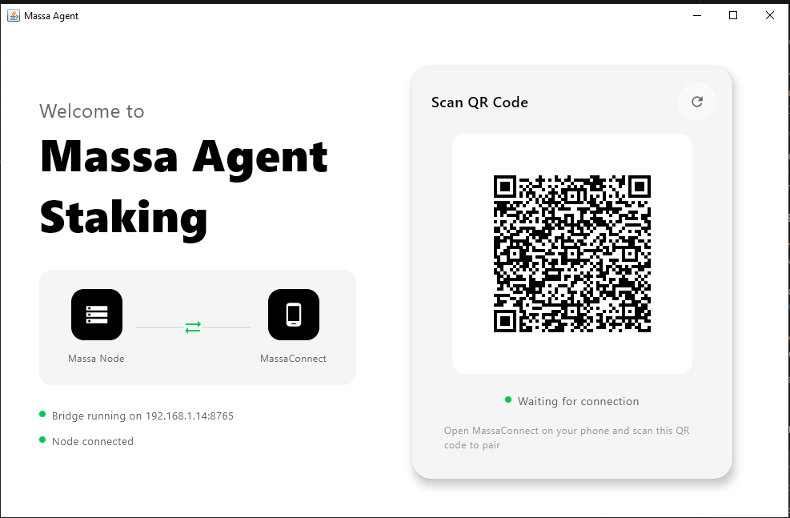
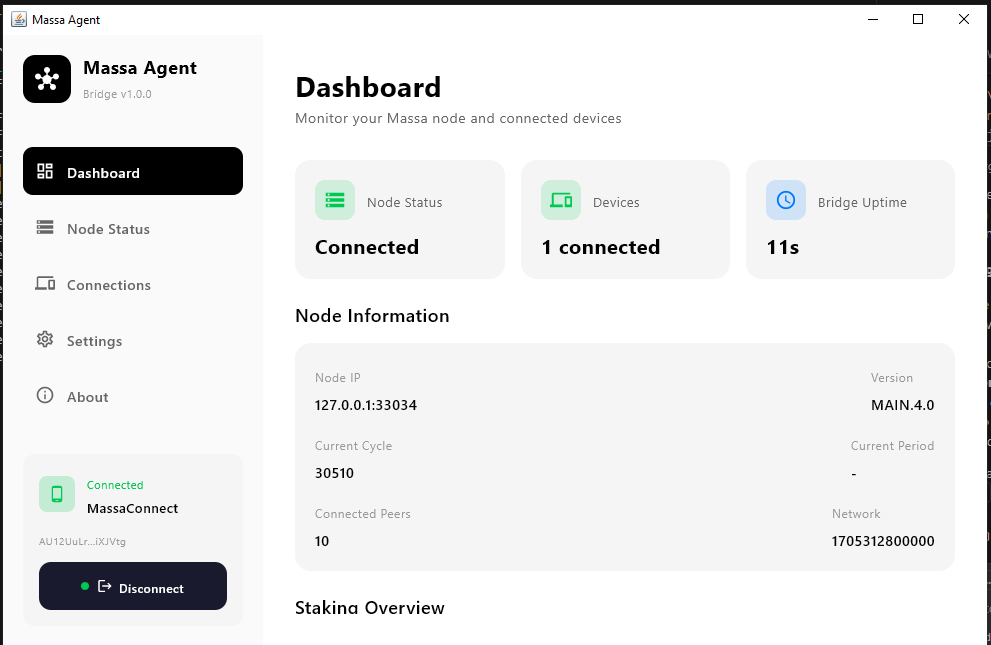
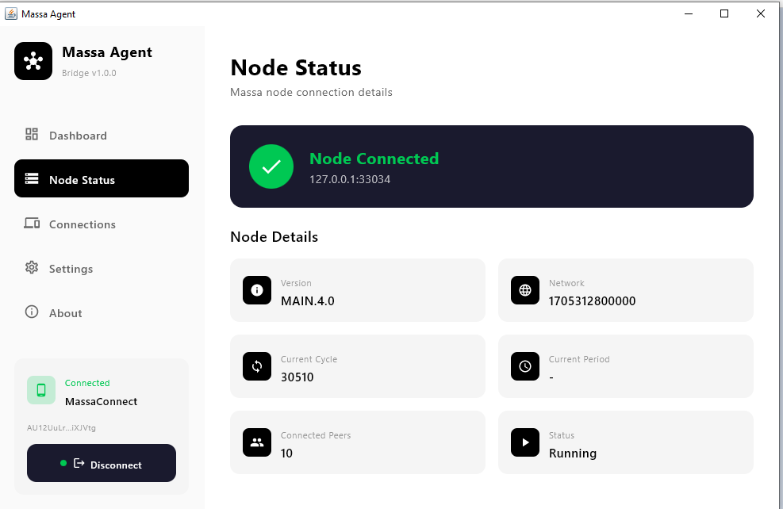

# Massa Agent Desktop

**Remote control your Massa node from anywhere with MassaConnect mobile app.**

Massa Agent Desktop is a lightweight desktop application that acts as a bridge between your Massa blockchain node and the MassaConnect mobile wallet. It enables secure remote staking management, node monitoring, and reward tracking without exposing your node to the internet.

---

## Features

- **Secure WebSocket Bridge**: Connect MassaConnect mobile app to your local Massa node
- **Real-time Node Monitoring**: Track node status, version, and network info
- **Staking Management**: Buy/sell rolls remotely from your mobile device
- **Reward Tracking**: Monitor staking rewards and active rolls
- **QR Code Pairing**: Simple and secure device pairing
- **Persistent Connection**: Auto-reconnect mechanism ensures 24/7 availability
- **Cross-Platform**: Works on Windows, macOS, and Linux

---

## Requirements

### System Requirements
- **Java Runtime**: Java 17 or higher ([Download](https://adoptium.net/))
- **Operating System**: Windows 10+, macOS 10.14+, or Linux
- **RAM**: Minimum 256MB
- **Massa Node**: Running locally on the same machine

### Network Requirements
- Massa node must be running and accessible
- Port **8765** available for WebSocket server
- Mobile device and desktop must be on the same local network for pairing

---

## Quick Start

### 1. Download

Download the latest release for your platform:
- **Windows**: `MassaAgent-windows-x64-1.0.0.jar`
- **macOS**: `MassaAgent-macos-x64-1.0.0.jar`
- **Linux**: `MassaAgent-linux-x64-1.0.0.jar`

### 2. Run the Application

#### Windows
```bash
java -jar MassaAgent-windows-x64-1.0.0.jar
```

#### macOS / Linux
```bash
java -jar MassaAgent-macos-x64-1.0.0.jar
```

### 3. Connect with MassaConnect

1. **Launch Massa Agent Desktop** - The application will start and display a QR code
2. **Open MassaConnect** mobile app on your phone
3. **Navigate to Agent tab** at the bottom
4. **Scan QR code** from the desktop application
5. **Start managing** your node remotely!

---

## Screenshots

### QR Code Pairing

*Simple QR code pairing - Scan with MassaConnect mobile app*

### Connected Device Dashboard

*Dashboard showing connected mobile device and real-time status*

### Node Information

*Detailed node information and network statistics*

### Active Connection

*Active connection with device details and session info*

---

## Build from Source

### Prerequisites
- JDK 17 or higher
- Gradle 8.4+

### Clone and Build
```bash
git clone https://github.com/yourusername/massa-agent-desktop.git
cd massa-agent-desktop

# Build the project
./gradlew build

# Package platform-specific JAR
./gradlew packageUberJarForCurrentOS

# Output will be in: build/compose/jars/
```

---

## Architecture

```
+-----------------+         WebSocket          +------------------+
¦  MassaConnect   ¦?-------- Port 8765 --------?¦  Massa Agent     ¦
¦  Mobile App     ¦         (Local Network)     ¦  Desktop         ¦
+-----------------+                             +------------------+
                                                         ¦
                                                         ¦ JSON-RPC
                                                         ?
                                                +------------------+
                                                ¦   Massa Node     ¦
                                                ¦   (Port 33035)   ¦
                                                +------------------+
```

### Key Components

- **Bridge Server**: WebSocket server for mobile communication
- **Node Client**: JSON-RPC client for Massa node interaction
- **UI Layer**: Compose Desktop for cross-platform interface
- **Auto-reconnect**: Persistent connection without timeout

---

## Security Features

- **Local Network Only**: Bridge operates on LAN, not exposed to internet
- **Session-based**: Unique session ID per connection
- **No Private Keys**: Agent never stores or transmits private keys
- **Read-Only by Default**: Staking operations require mobile confirmation

---

## Configuration

### Default Ports
- **Bridge Server**: 8765 (WebSocket)
- **Massa Node**: Auto-detected (typically 33035)

### Advanced Settings
Edit `gradle.properties` to customize:
```properties
# Bridge configuration
bridge.port=8765
node.ip=127.0.0.1
```

---

## API Documentation

### Supported Bridge Methods

| Method | Description | Parameters |
|--------|-------------|------------|
| `connect` | Register mobile device | `deviceName`, `platform`, `walletAddress` |
| `get_node_status` | Get node information | - |
| `get_staking_info` | Get staking details | `address` |
| `get_staking_addresses` | List registered addresses | - |
| `get_rewards` | Get reward information | `address` |
| `buy_rolls` | Purchase rolls | `address`, `rollCount` |
| `sell_rolls` | Sell rolls | `address`, `rollCount` |
| `add_staking_key` | Register staking key | `secretKey` |
| `remove_staking_key` | Remove staking key | `address` |
| `send_operations` | Send signed operations | `operations` |

---

## Integration with MassaConnect

Massa Agent Desktop is designed to work seamlessly with **MassaConnect** - a modern mobile wallet for Massa blockchain.

### Features when paired:
- Remote staking management
- Real-time balance updates (every 15 seconds)
- Instant notification of rewards
- Buy/sell rolls with mobile confirmation
- Node status monitoring

[Download MassaConnect](https://github.com/yourusername/massapay)

---

## Troubleshooting

### Connection Issues

**Problem**: Mobile app can't connect to desktop
- Verify both devices are on the same WiFi network
- Check port 8765 is not blocked by firewall
- Restart Massa Agent Desktop

**Problem**: Node not detected
- Ensure Massa node is running
- Check node RPC port is accessible
- Verify node is synced

### Build Issues

**Problem**: Gradle build fails
- Verify JDK 17+ is installed: `java -version`
- Clean build: `./gradlew clean build`
- Delete `.gradle` folder and retry

---

## Changelog

### Version 1.0.0 (Current)
- Initial release
- WebSocket bridge server
- QR code pairing
- Node monitoring
- Staking management
- Persistent connection with auto-reconnect
- Zero-timeout WebSocket for 24/7 availability

---

## Roadmap

- [ ] Multi-node support
- [ ] Desktop notifications for rewards
- [ ] Auto-start on system boot
- [ ] Windows/macOS installer packages
- [ ] Remote node connection (via VPN)
- [ ] Advanced node statistics

---

## Development

### Project Structure
```
massa-agent-desktop/
+-- src/main/kotlin/com/massapay/agent/
¦   +-- Main.kt                    # Application entry point
¦   +-- bridge/
¦   ¦   +-- BridgeServer.kt        # WebSocket server
¦   ¦   +-- BridgeProtocol.kt      # Protocol definitions
¦   ¦   +-- MassaNodeClient.kt     # Node RPC client
¦   +-- ui/
¦       +-- screens/
¦       ¦   +-- DashboardScreen.kt # Main dashboard
¦       ¦   +-- PairingScreen.kt   # QR pairing screen
¦       +-- theme/
¦           +-- Theme.kt           # UI theming
+-- build.gradle.kts               # Build configuration
+-- README.md
```

### Technologies Used
- **Kotlin** 1.9.21
- **Compose Desktop** 1.5.11
- **Ktor** (WebSocket & HTTP)
- **Kotlinx Serialization** (JSON)
- **Coroutines** (Async operations)

---

## License

MIT License - See [LICENSE](LICENSE) file for details

---

## Contributing

Contributions are welcome! Please feel free to submit a Pull Request.

1. Fork the repository
2. Create your feature branch (`git checkout -b feature/AmazingFeature`)
3. Commit your changes (`git commit -m 'Add some AmazingFeature'`)
4. Push to the branch (`git push origin feature/AmazingFeature`)
5. Open a Pull Request

---

## Support

- **Issues**: [GitHub Issues](https://github.com/yourusername/massa-agent-desktop/issues)
- **Discussions**: [GitHub Discussions](https://github.com/yourusername/massa-agent-desktop/discussions)
- **Massa Community**: [Discord](https://discord.gg/massa)

---

## Acknowledgments

- Massa Labs for the amazing blockchain technology
- The Massa community for continuous support
- All contributors to this project

---

**Made with ?? for the Massa ecosystem**
